# 🍳 API-MasterChef

**Taller Semana de Receso**  
**Presentado por:** *Julian Lopez*  


---

## 📖 Descripción del Proyecto

Un importante programa de telerrealidad de cocina va a sacar su sitio Web para que todos los televidentes puedan consultar y aprender sobre las recetas que han aparecido a lo largo de las temporadas, sin embargo, también quiere que sea interactivo, donde los televidentes pueden publicar sus recetas.
Por tal motivo nuestra empresa DOSW Company ha sido seleccionada para desarrollar esta iniciativa en su Fase inicial, por lo tanto, usted va a construir una API de gestión de recetas de cocina.
Cada Receta tendrá un título, una lista de ingredientes y los pasos de preparación de la receta, adicional tendrá el nombre del chef que podrá ser un concursante del programa, un chef de los jurados o un televidente del común.
En caso de que sea un participante tiene que establecer en que temporada salió esa receta.


## 🖼️ Imagen Swagger
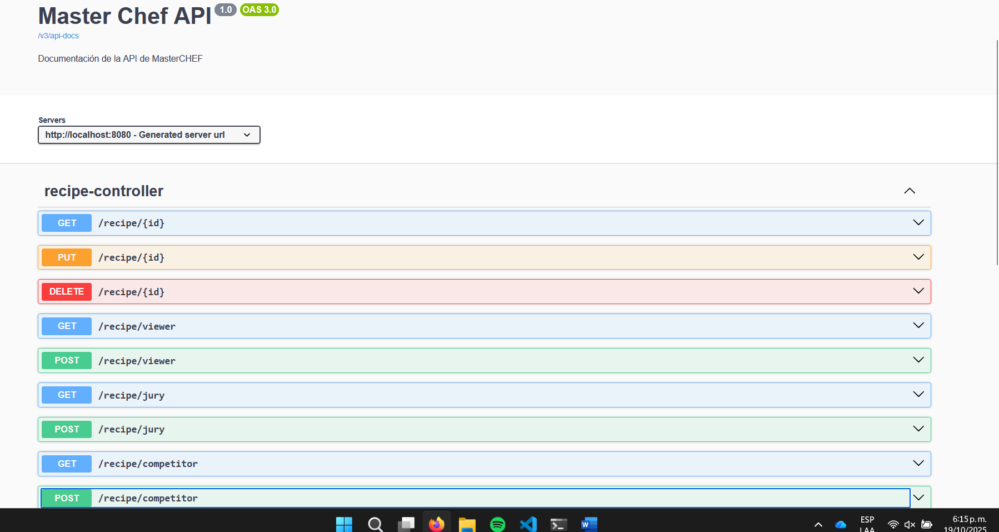
---

## 🥸 Estructura Request-Response EndPoints (Casi no sirve...)
### "POST" http://localhost:8080/recipe/jury
- Request

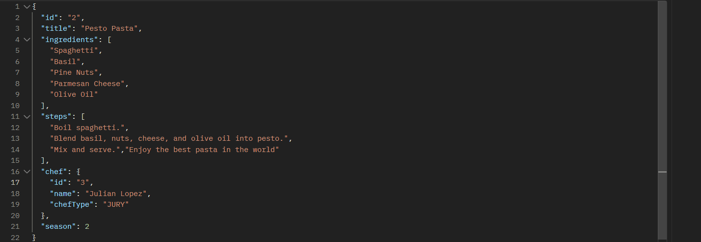
- Response

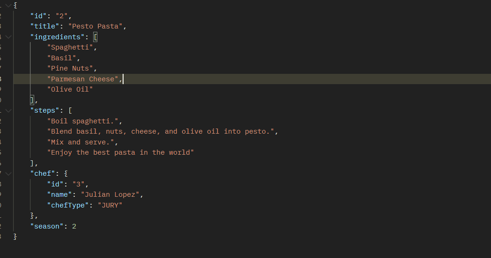

### "POST" http://localhost:8080/recipe/competitor
-Request 

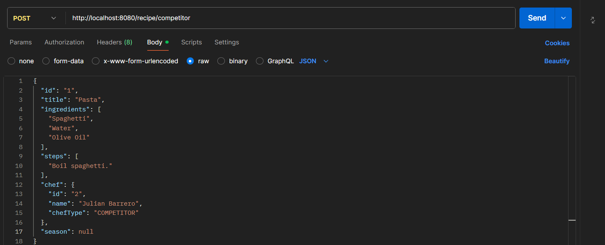
- Response

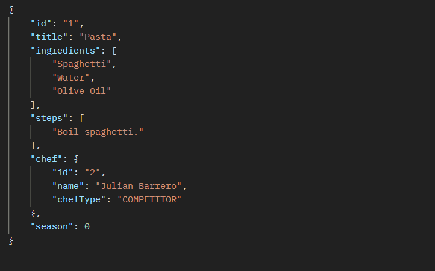

### "POST" http://localhost:8080/recipe/viewer
-Request

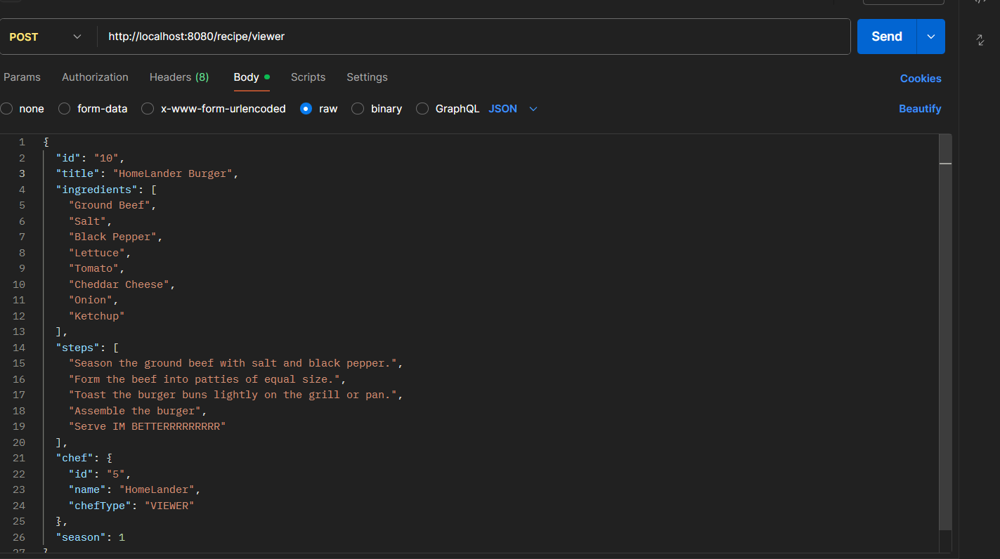
-Response 

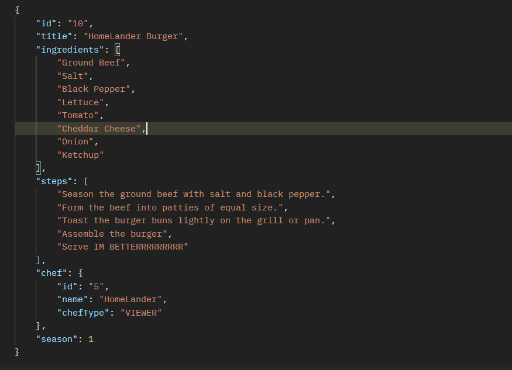

### "GET" http://localhost:8080/recipe/recipes

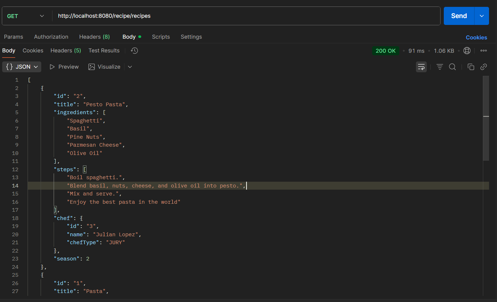

### "GET" http://localhost:8080/recipe/10

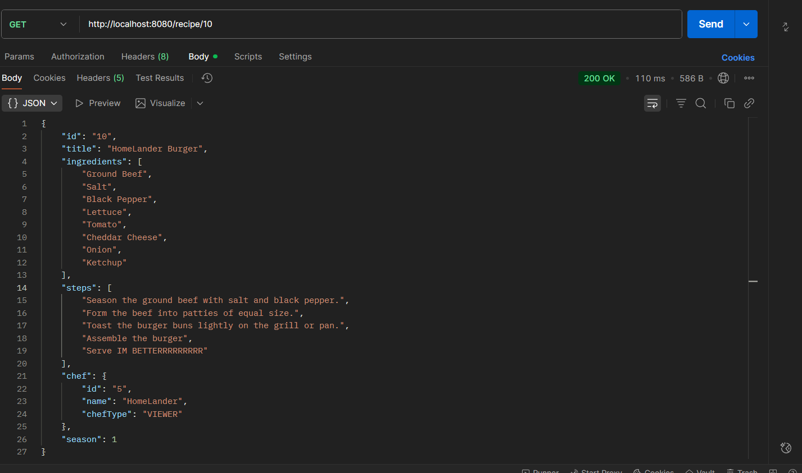

### "GET" http://localhost:8080/recipe/competitor

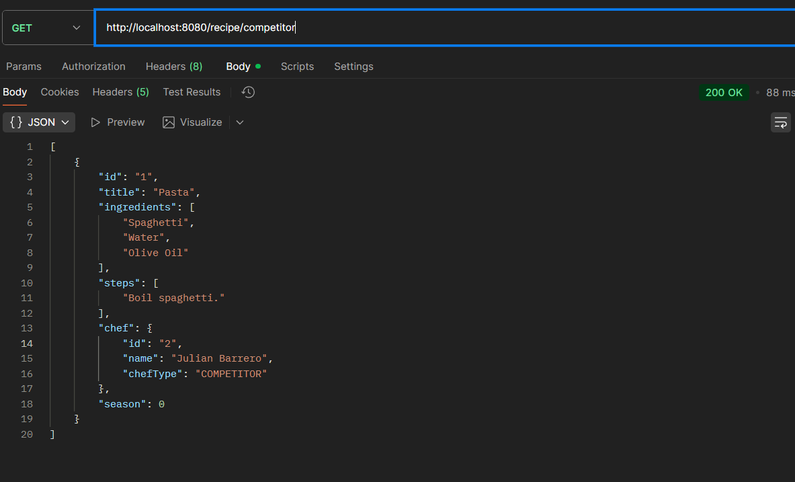

### "GET" http://localhost:8080/recipe/viewer

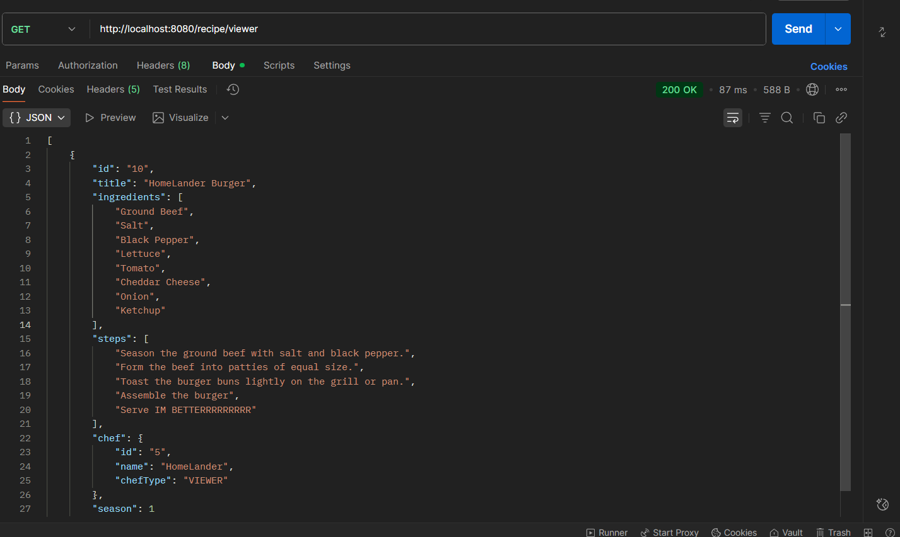

### "GET" http://localhost:8080/recipe/jury

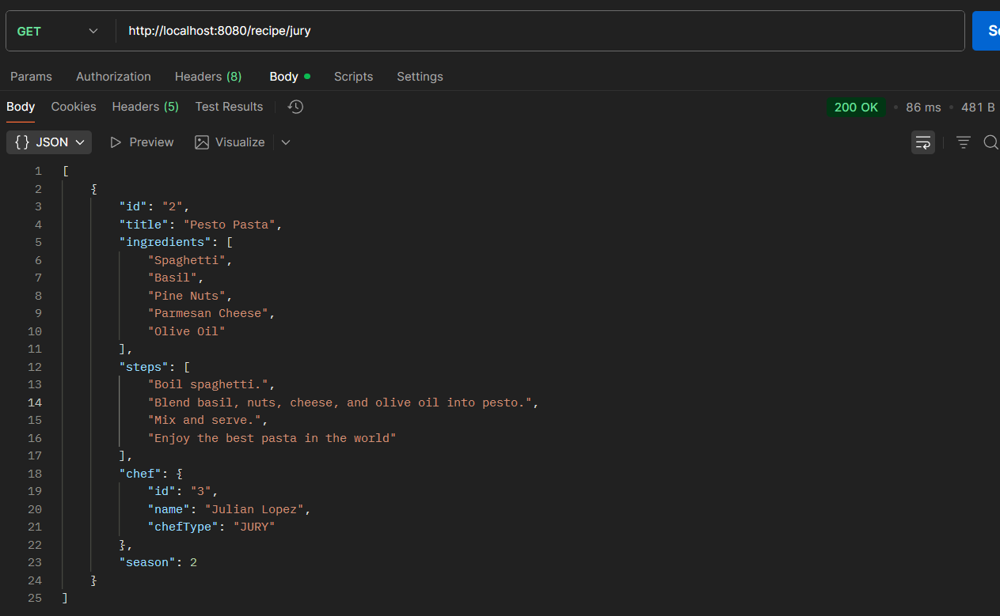

### "GET" http://localhost:8080/recipe/season/2

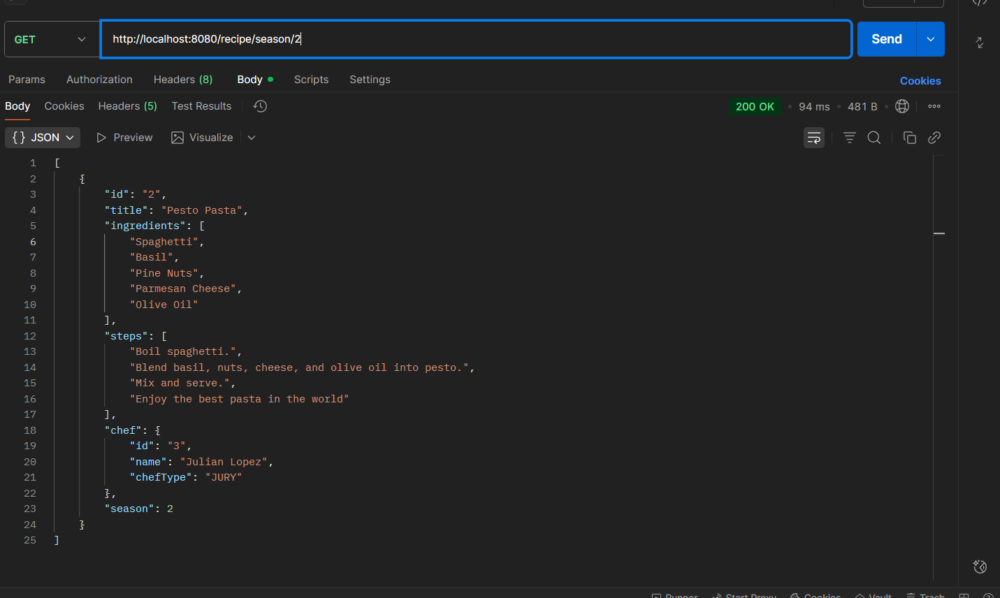

### "GET" http://localhost:8080/recipe/recipe/Ketchup

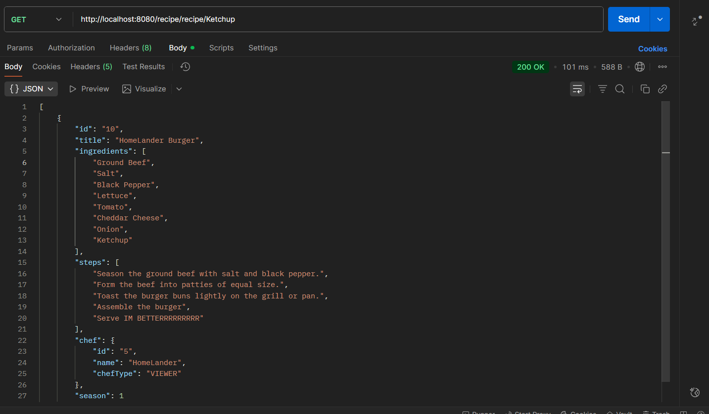

### "Delete" http://localhost:8080/recipe/10

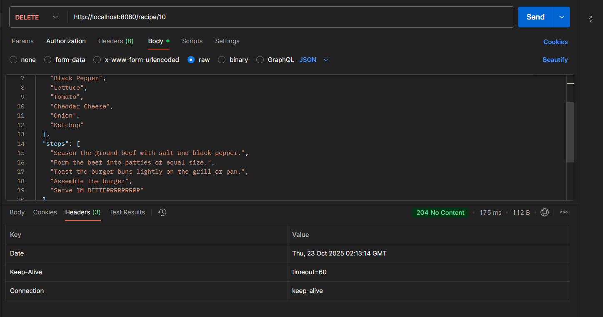

### "PUT" http://localhost:8080/recipe/999

- Se creo la de homelander otra vez con id 999 y se actualizo


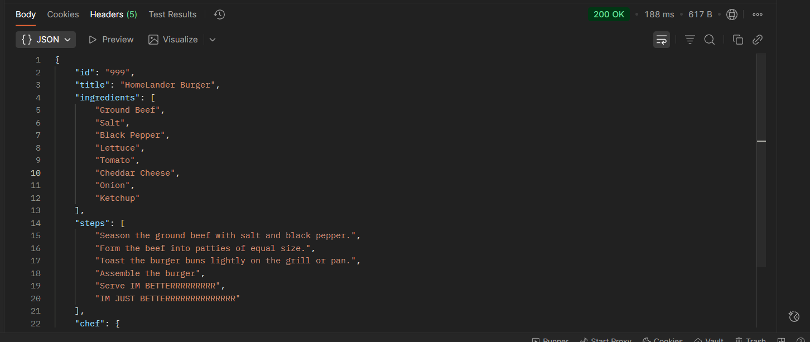


## Link Azure Swagger

    https://masterchef-feaxhgdabggufyb9.canadacentral-01.azurewebsites.net/swagger-ui/index.html#/

## CI/CD
- Test

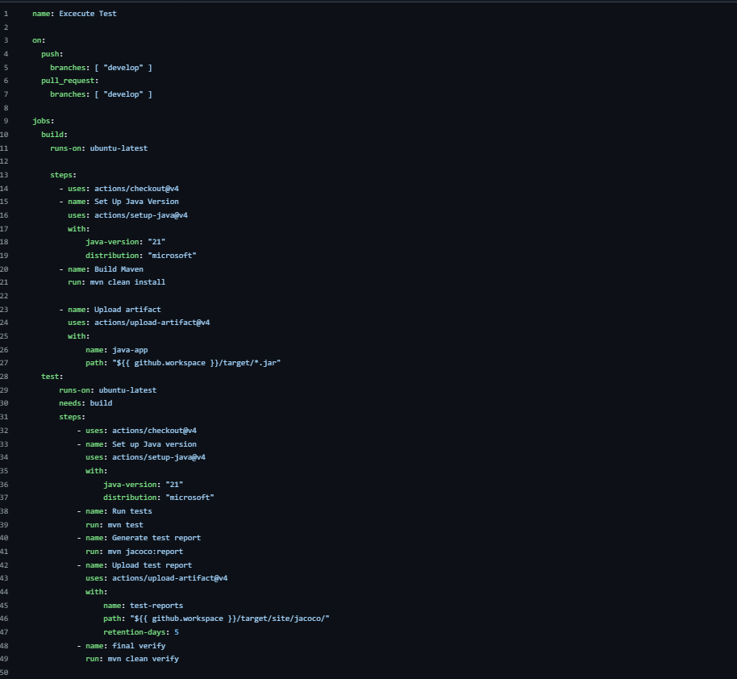
---

- Azure

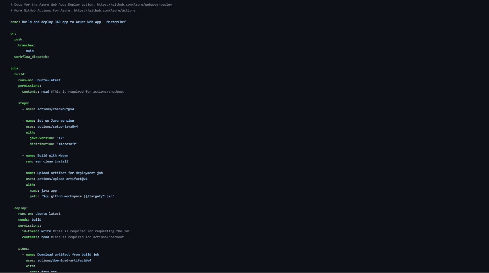 
---
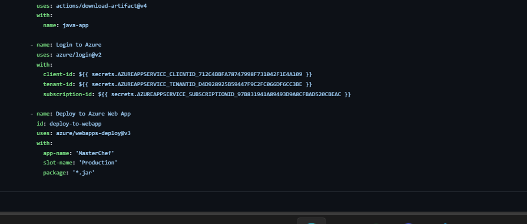


## 🚀 Instalación y Ejecución Local

1. _Clonar el repositorio_
    ```bash
    git clone https://github.com/JulianLopez11/API-MasterChef.git
    ```
2. _Entrar al directorio del proyecto_

    ```bash
    cd API-MasterChef
    ```

3. _Compilar el proyecto_
    ```bash
    mvn clean compile
    ```
4. _Ejecutar la aplicación_
    ```bash
    mvn clean verify
    mvn spring-boot:run
    ```